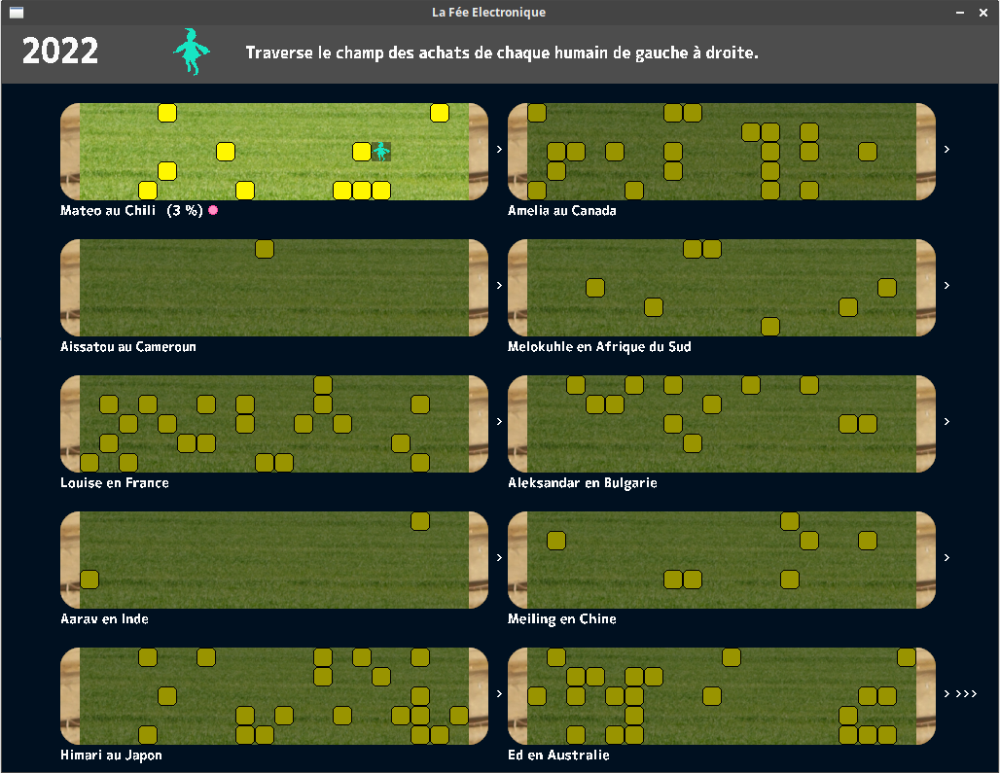

# La Fée électronique

par Sébastien Abilla

distribué sous licence [GNU GPLv3](https://www.gnu.org/licenses/gpl-3.0.html) (voir fichier LICENSE)



Aide les humains à organiser leur consommation de produits électroniques pendant 10 ans en évitant d'être noyer sous les encombrants.

### Code source

[GitHub](https://github.com/sebabilla/lafeeelectronique)

### Aperçu vidéo

[YouTube](https://youtu.be/T08urJjkGF0)

### Jouer en ligne:

[https://seb46.itch.io/la-fe-electronique](https://seb46.itch.io/la-fe-electronique)


### Compilation

##### Web Assembly avec Emscriptem

```
emcc *c -O2 -s USE_SDL=2 -s USE_SDL_TTF=2 --preload-file res/ -s USE_SDL_GFX=2 -s USE_SDL_MIXER=2 -s USE_SDL_IMAGE=2 -s SDL2_IMAGE_FORMATS='["png"]' -s ALLOW_MEMORY_GROWTH -o fee.html
```

##### Executable linux avec gcc

dépendances:

* libsdl2-dev
* libsdl2-gfx-dev
* libsdl2-image-dev
* libsdl2-mixer-dev
* libsdl2-ttf-dev

```
gcc *.c -Wall -o fee -lm $(sdl2-config --cflags --libs) -lSDL2_gfx -lSDL2_ttf -lSDL2_mixer -lSDL2_image
```


### Crédits

##### Développement

Développement; [code](https://github.com/sebabilla/lafeeelectronique); illustrations des terrains et cartes d'action; texte original en Français, traductions en Anglais et Japonais par Sébastien Abilla ([GNU GPLv3](https://www.gnu.org/licenses/gpl-3.0.html))  
Les autres assets listés ci-dessous sont redistribués sous les mêmes licences libres que les originaux à partir desquels ils sont modifés.

##### Musiques

[The Carnival of the Animals](https://musopen.org/music/1454-the-carnival-of-the-animals/#recordings) par Seattle Youth Symphony Orchestra ([CC BY-SA 3.0](https://creativecommons.org/licenses/by-sa/3.0/))  
Pièces (le volume a été diminué):  
The Carnival of the Animals - IV. Tortoises  
The Carnival of the Animals - VIII. Personages with long ears  
The Carnival of the Animals - IX. The Cuckoo in the deep woods  
The Carnival of the Animals - XIII. The Swan  
The Carnival of the Animals - XII. Fossils  

##### Effets sonores

Adaptés de [LaSonothèque](https://lasonotheque.org/apropos.html) of Joseph Sardin ([CC0 1.0](https://creativecommons.org/publicdomain/zero/1.0/deed.fr))

##### Personnages

Mix et modifications d'0penCliparts de [GDJ](https://openclipart.org/artist/GDJ) ([CC0 1.0](https://creativecommons.org/publicdomain/zero/1.0/deed.fr)) 

##### Icones

[Candy icons](https://github.com/EliverLara/candy-icons) par Eliver Lara ([GNU GPLv3](https://www.gnu.org/licenses/gpl-3.0.html))

##### Image de fond

Modifiée d'une photo de LAN par [Toffelginkgo](https://commons.wikimedia.org/wiki/File:Winter_2004_DreamHack_LAN_Party.jpg) ([CC BY-SA 3.0](https://creativecommons.org/licenses/by-sa/3.0/))

##### Fonts

M+ 2p heavy by [M+ FONTS PROJECT](https://mplusfonts.github.io/) ([SIL OFL](https://scripts.sil.org/cms/scripts/page.php?site_id=nrsi&id=OFL))